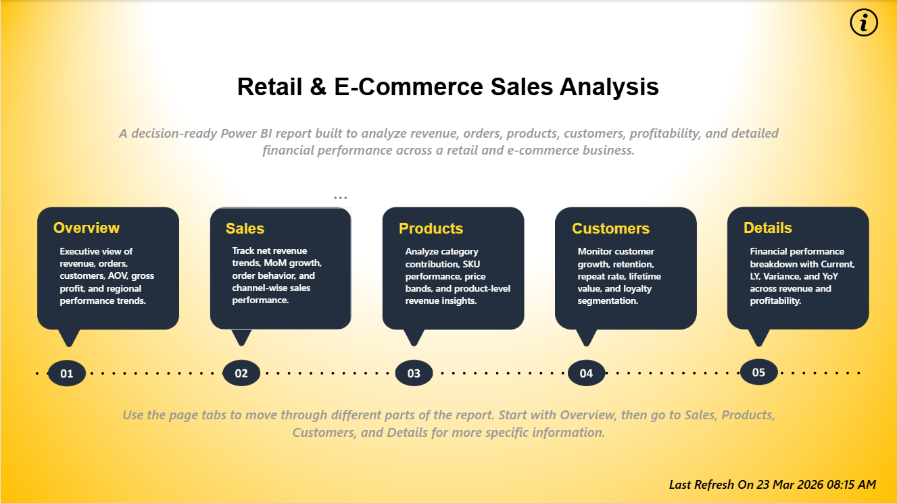
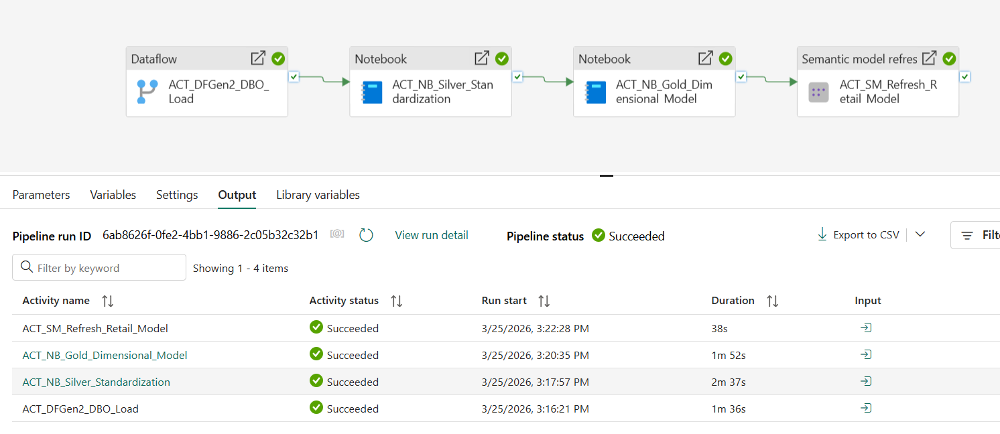
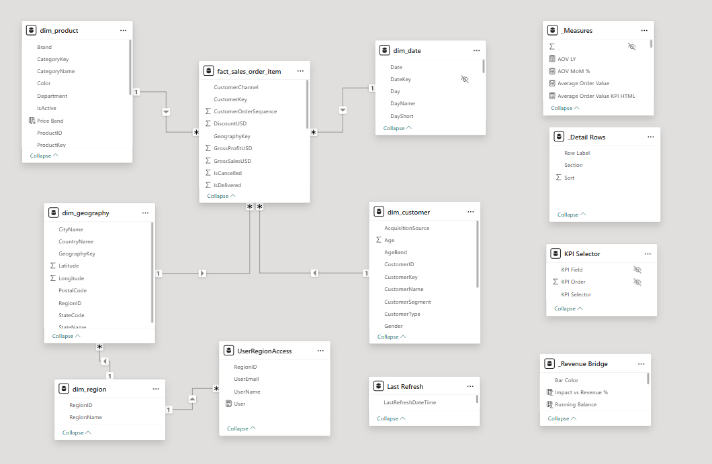

# Retail & E-Commerce Sales Analysis

Retail and e-commerce analytics solution built with **Microsoft Fabric** and **Power BI**. The project takes an Excel-based operational dataset through a medallion-style Fabric architecture, creates a reporting-ready dimensional model in OneLake, and serves the Power BI semantic model using **Direct Lake**.

The solution covers data ingestion, standardization, dimensional modeling, orchestration, Direct Lake semantic modeling, DAX, row-level security, validation, source control, and interactive report development.

## Live Report

https://app.powerbi.com/view?r=eyJrIjoiZGNkYzI4NGItY2FiNS00Njg0LTg5NGUtY2UyOTZiNGFkNTNkIiwidCI6IjI1Y2UwMjYxLWJiZDYtNDljZC1hMWUyLTU0MjYwODg2ZDE1OSJ9&pageName=fa9b1cf475e064bbb51d



## Challenge Context

This project was built for the **Power BI School Dashboard Competition — Dashboard Wars: Season 1**.

Challenge: https://www.skool.com/powerbi-school-6896/can-your-dashboard-win-50

The challenge focused on building a business-oriented dashboard that turns raw data into useful insight while keeping the analytical experience clear, interactive, and easy to navigate.

---

## Project Overview

The report is designed around questions a retail or e-commerce team would normally ask when reviewing business performance:

- How are revenue and orders changing over time?
- Which products and categories contribute the most to sales and profit?
- Which regions and channels are driving performance?
- How many customers are new versus repeat customers?
- What is the repeat customer rate?
- How much revenue is being reduced by discounts and returns?
- What are the delivery, cancellation, and return rates?
- Which products, customer groups, and geographies need deeper investigation?

### Data Scale

- approximately **30,848 order-item rows**
- **20,000 orders**
- **8,000 customers**
- **200 products**
- **150 geographies**
- **4 regions**
- transaction dates from **January 2021 to March 2026**

The analytical grain is **one row per order item**. This allows product-level sales, quantity, discount, return, cost, and profitability analysis while still supporting order- and customer-level KPIs through distinct-count measures.

---

## Solution Architecture

```text
OLTP.xlsx
    ↓
Dataflow Gen2 — ingestion and source-level preparation
    ↓
Lakehouse `dbo` landing tables
    ↓
Silver Notebook — standardization and quality checks
    ↓
Gold Notebook — dimensional model
    ↓
Gold Delta tables in OneLake
    ↓
Power BI Semantic Model — Direct Lake on OneLake
    ↓
Power BI Report
```




### Architecture Responsibilities

| Layer | Responsibility |
|---|---|
| **Source** | Excel workbook containing operational retail entities and transactions |
| **Dataflow Gen2** | Connects to the source workbook, performs ingestion-level preparation, and loads the source entities into the Lakehouse `dbo` landing layer |
| **Lakehouse / dbo** | Stores the ingested source-aligned tables used as the starting point for downstream processing |
| **Silver** | Standardizes data types, text values, keys, null handling, duplicates, and schema consistency |
| **Gold** | Creates reporting-ready fact and dimension Delta tables with stable analytical keys and business attributes |
| **Direct Lake Semantic Model** | Defines relationships, DAX measures, filter behavior, formatting, RLS, and business semantics directly over Gold Delta tables |
| **Report** | Delivers KPI monitoring, trends, filters, navigation, tooltips, and business analysis |

A key design principle in this project is to keep transformation logic in the correct layer. Structural cleaning and reusable row-level logic are handled before the semantic model, while Power BI is responsible for analytical relationships, reusable measures, security, and report behavior.

---

## Fabric Items and Naming Convention

Fabric items follow a simple ordered naming pattern so the workspace reflects the processing sequence clearly.

```text
<NN>_<TYPE>_<Layer>_<Purpose>
```

| Item | Type | Purpose |
|---|---|---|
| `00_ORCH_EndToEnd_Data_Pipeline` | Fabric Pipeline | Orchestrates the data-processing sequence |
| `01_DFGen2_Ingestion_Transformation_DBO` | Dataflow Gen2 | Ingests `OLTP.xlsx` and loads source-aligned tables into the Lakehouse `dbo` layer |
| `02_NB_Silver_Layer_Standardization` | Fabric Notebook | Cleans and standardizes the ingested tables into Silver |
| `03_NB_Gold_Layer_Dimensional_Model` | Fabric Notebook | Builds the Gold star schema and applies final data-quality checks |
| `LH_Ecommerce` | Lakehouse | Stores `dbo`, Silver, and Gold Delta tables in OneLake |
| `04_SM_Retail_ECommerce_Sales_Model` | Semantic Model | Direct Lake semantic model over Gold Delta tables |
| `05_RPT_Retail_ECommerce_Sales_Analysis` | Power BI Report | Final interactive analytics report |

### Fabric Workspace Structure

These are the main components that exist in the Fabric workspace. They are part of the implemented solution, but they are **not part of the Azure DevOps source-control scope** used for the Power BI project files.

```text
Retail-Ecommerce-Analytics
│
├── 00_ORCH_EndToEnd_Data_Pipeline
│
├── 01_DFGen2_Ingestion_Transformation_DBO
│       └── OLTP.xlsx → Lakehouse dbo tables
│
├── 02_NB_Silver_Layer_Standardization
│       └── dbo → Silver
│
├── 03_NB_Gold_Layer_Dimensional_Model
│       └── Silver → Gold fact and dimensions
│
├── LH_Ecommerce
│   ├── dbo
│   ├── silver
│   └── gold
│
├── 04_SM_Retail_ECommerce_Sales_Model
│       └── Direct Lake on OneLake
│
└── 05_RPT_Retail_ECommerce_Sales_Analysis
        └── Power BI report
```

Prefix convention:

- `ORCH` — orchestration pipeline
- `DFGen2` — Dataflow Gen2
- `NB` — Notebook
- `SM` — Semantic Model
- `RPT` — Report
- `LH` — Lakehouse

---

## Fabric Workflow

### 1. Source Review

The source is a single `OLTP.xlsx` workbook containing customers, products, orders, order items, customer segments, addresses, channels, geography, regions, order statuses, and date-related fields.

Before ingestion and modeling, the source structure is reviewed to understand:

- business entities and keys
- table grain
- relationships between entities
- required data types
- reporting dimensions
- KPI requirements
- fact-versus-dimension placement

This provides a clear contract for the downstream Fabric and Power BI layers.

### 2. Data Ingestion with Dataflow Gen2

`01_DFGen2_Ingestion_Transformation_DBO` is the ingestion layer for the project.

Dataflow Gen2 connects to `OLTP.xlsx`, reads the required source entities, applies the ingestion-level preparation needed for reliable loading, and writes the results into the `dbo` area of `LH_Ecommerce`.

The `dbo` tables remain close to the source structure so the landing layer stays easy to trace back to the original workbook.

The ingestion flow covers:

- connecting to the Excel source
- selecting the required sheets/tables
- assigning appropriate source data types
- handling obvious blank/null values where required for loading
- loading each entity into the Lakehouse
- providing a repeatable ingestion step that can be called from the Fabric pipeline

```text
OLTP.xlsx
    ↓
Dataflow Gen2
    ↓
LH_Ecommerce.dbo
```

Dataflow Gen2 is used specifically for **data ingestion** in this project. More detailed standardization and analytical transformations are handled in the Silver and Gold notebooks instead of mixing all transformation logic into the ingestion step.

### 3. Silver Standardization

`02_NB_Silver_Layer_Standardization` reads the `dbo` landing tables and prepares consistent, trusted inputs for dimensional modeling.

Typical Silver processing includes:

- trimming and standardizing text
- converting blank strings to NULL where appropriate
- enforcing downstream data types
- standardizing postal codes and other formatted identifiers
- validating business keys
- removing invalid duplicate business keys
- adding technical load metadata where required
- checking row counts between `dbo` and Silver

```text
Lakehouse dbo
    ↓
Silver standardization notebook
    ↓
Silver Delta tables
```

The Silver layer gives the Gold notebook a stable schema instead of requiring the dimensional model to repeatedly handle raw source inconsistencies.

### 4. Gold Dimensional Modeling

`03_NB_Gold_Layer_Dimensional_Model` creates the reporting-ready dimensional layer used by the Direct Lake semantic model.

Main Gold tables include:

```text
dim_date
dim_region
dim_geography
dim_customer
dim_product
fact_sales_order_item
```

The Gold layer handles:

- dimensional key creation and alignment
- fact/dimension structure
- reporting-ready attributes
- stable row-level classifications
- relationship-key type consistency
- data-quality checks before reporting

Because the semantic model uses Direct Lake, stable row-level transformations are intentionally materialized in Gold so the semantic model can stay focused on analytical logic, relationships, security, and presentation.

### 5. Direct Lake Semantic Model

`04_SM_Retail_ECommerce_Sales_Model` is built directly over the Gold Delta tables in OneLake using **Direct Lake**.

The semantic model defines:

- relationships
- DAX measures
- business definitions
- formatting
- filter behavior
- dynamic RLS
- report-facing metadata

The Gold data remains in OneLake rather than being copied into a traditional imported semantic-model cache.

### 6. Power BI Report

`05_RPT_Retail_ECommerce_Sales_Analysis` consumes the curated semantic model rather than connecting directly to `OLTP.xlsx`, the `dbo` layer, or Silver tables.

This keeps the report focused on reusable business measures and interactive analysis instead of source-level transformation logic.

### 7. Orchestration

`00_ORCH_EndToEnd_Data_Pipeline` controls the backend processing order.

```text
01_DFGen2_Ingestion_Transformation_DBO
    ↓
02_NB_Silver_Layer_Standardization
    ↓
03_NB_Gold_Layer_Dimensional_Model
    ↓
Direct Lake semantic-model refresh / framing
    ↓
Power BI report
```

The pipeline provides a single execution path from source ingestion through the reporting-ready Gold layer. The semantic model then reflects the latest Gold Delta state for reporting.

---

## Data Model

The analytical model follows a **star-schema design** at order-item grain.

### Fact Table

`fact_sales_order_item`

The fact contains transaction-level fields used for:

- quantity
- sales
- discount
- returns
- cost
- profit
- order-status analysis
- customer-order behavior

### Dimension Tables

- `dim_date`
- `dim_customer`
- `dim_product`
- `dim_geography`
- `dim_region`

### Modeling Principles

- clear separation between facts and descriptive dimensions
- one-to-many relationships from dimensions to the fact
- single-direction filter flow wherever possible
- no unnecessary many-to-many relationships
- consistent data types on relationship keys
- business-friendly descriptive attributes in dimensions
- technical keys hidden from report users where they add no reporting value
- reusable business calculations centralized as measures

The model is designed so filters such as date, product, customer, region, and geography behave predictably across all report pages.

---

## Power BI Data Modeling

The semantic model builds on the curated Gold Delta tables and defines the analytical relationships, business logic, presentation behavior, and security used by the report.

### Relationship Design

The model was validated for:

- which table owns each business key
- one-side versus many-side cardinality
- active relationship paths
- filter direction
- whether any relationship could introduce ambiguity
- whether the fact grain supports the intended measure

Keeping the model as a clean star schema makes DAX easier to understand and reduces unexpected filter behavior.

### Date Modeling

`dim_date` is materialized in the Gold layer and connected to the fact table through the reporting date key.

This supports:

- year and month analysis
- prior-period comparison
- YTD and rolling analysis
- chronological sorting
- consistent time filtering across pages

Keeping the date dimension in Gold also makes the table reusable outside a single Power BI semantic model.

### Model Presentation

The semantic layer is also prepared for report authors and users by:

- hiding technical keys
- applying business-friendly names
- setting numeric and percentage formats
- defining sort-by behavior
- grouping measures logically
- keeping report calculations out of individual visual expressions

### Security Mapping

`UserRegionAccess` is maintained as the access-mapping table used by dynamic RLS.

The purpose is to keep authorization logic data-driven instead of creating many separate static report copies or user-specific reports.

---

## Semantic Model

The Direct Lake semantic model contains the Gold tables plus supporting analytical objects.

| Table / Object | Purpose |
|---|---|
| `_Measures` | Central location for reusable DAX measures |
| `KPI Selector` | Supports dynamic KPI selection |
| `KPI Combo Selector` | Supports comparison between selected KPIs |
| `_Detail Rows` | Controls detailed analytical presentation |
| `_Revenue Bridge` | Supports revenue-to-profit bridge analysis |
| `Last Refresh` | Gives users visibility into data recency |
| `UserRegionAccess` | Mapping table for dynamic RLS |

Business logic is intentionally separated from page design. A KPI is defined once in the semantic model and reused wherever needed in the report.

---

## DAX Measures

Business calculations are centralized in measures rather than repeated across visuals.

| Area | Measures |
|---|---|
| **Core KPIs** | Net Revenue, Gross Sales, Order Count, Customer Count, Average Order Value, Gross Profit, Gross Margin % |
| **Profitability** | Discount Amount, Return Amount, Product Cost, Revenue vs Profit |
| **Customer** | Total Customers, New Customers, Repeat Customers, Repeat Customer Rate, customer contribution |
| **Order Quality** | Delivery Rate, Cancellation Rate, Return Rate, order-status breakdown |
| **Time Intelligence** | MoM, YoY, YTD, rolling-period and prior-period measures |
| **Contribution** | Product/category contribution %, regional share, channel share |
| **Dynamic Analysis** | KPI selectors and context-aware measures reused across pages |

### Measure Design Approach

Row-level preparation is kept in Gold, while DAX is used mainly for calculations that depend on filter context.

Examples include:

- distinct order counts from an order-item fact
- distinct customer counts
- margin calculations
- repeat-customer logic
- revenue contribution percentages
- prior-period comparisons
- dynamic metric switching

This keeps the semantic layer analytical rather than using DAX to compensate for avoidable data-shaping issues upstream.

---

## Direct Lake Implementation

Direct Lake influenced several design decisions in the project, especially around relationship keys, schema stability, row-level transformations, model synchronization, and security.

### 1. Relationship Key Consistency

A key requirement was **data-type consistency between fact and dimension keys**.

Fact and dimension relationship keys are standardized to the same data type before semantic modeling. For example, `GeographyKey` is aligned across the fact and geography dimension in the data layer.

**Implementation:**

- standardized relationship-key data types in Silver/Gold
- checked null and duplicate business keys before building the model
- validated that each dimension key was unique
- kept the fact-side key compatible with the dimension-side key

This made the Direct Lake model more predictable and also improved the quality of the Gold layer itself.

### 2. Row-Level Logic in Gold

Stable row-level business logic is prepared in the Gold layer, while the semantic model remains focused on relationships, measures, security, formatting, and report behavior.

**Implementation:**

Reusable row-level logic such as:

- reporting keys
- descriptive classifications
- date attributes
- stable bands or categories
- cleaned geography/customer attributes

is prepared in Gold where practical.

DAX is then used for filter-context calculations such as revenue, margin, repeat rate, contribution, and time intelligence.

This gives a cleaner separation:

```text
Gold = stable row-level analytical structure
Semantic Model = relationships + measures + security + presentation metadata
Report = visual interaction and storytelling
```

### 3. Schema Alignment

Column names, data types, and relationship keys are kept consistent between Gold and the Direct Lake semantic model so model objects remain aligned with the underlying OneLake tables.

**Implementation:**

- standardized Gold column names before report development
- kept business-facing names stable
- treated relationship keys and measure-dependent fields as part of the model contract
- checked the semantic model after structural Gold changes

This makes the contract between the Gold layer and semantic model explicit and reduces the risk of downstream breakage when schemas change.

### 4. Cloud Connection Configuration

A Direct Lake model still needs a valid cloud connection and identity path to access the OneLake data correctly.

**Implementation:**

- mapped the semantic model to the intended Fabric/OneLake connection
- validated that the model could access the Gold tables with the expected identity
- checked report behavior after connection changes
- kept connection configuration separate from DAX and report design

This made the data-access path easier to understand and support.

### 5. Direct Lake Framing and Synchronization

The model uses Direct Lake framing rather than a traditional import refresh of all Gold rows.

The semantic model does not need to copy the Gold Delta tables into an imported model after every pipeline run. Instead, the model updates its view of the current Delta table state through Direct Lake framing/metadata synchronization.

**Pipeline design:**

```text
Bronze complete
    ↓
Silver complete
    ↓
Gold complete
    ↓
Direct Lake model synchronized with the latest Gold state
    ↓
Report reads the updated model
```

Because the model uses Direct Lake, Power BI incremental-refresh partitions are not part of this design. Scalability is handled through the Delta/OneLake layer, Gold design, and Fabric capacity behavior.

### 6. Gold Delta Tables as the Reporting Source

The Direct Lake semantic model reads the curated Gold Delta tables directly. The Lakehouse SQL analytics endpoint is used separately for validation and investigation.

The reporting model reads the curated **Gold Delta tables** directly.

SQL views and T-SQL are used where they add value for:

- validation
- reconciliation
- ad-hoc investigation
- checking Gold outputs independently of Power BI

This keeps the Direct Lake path straightforward while still using SQL as an important analytical and validation tool.

### 7. RLS and Model Permissions

The project uses `UserRegionAccess` for dynamic row-level security.

RLS validation covers both the semantic-model logic and the access path used by report consumers.

**Implementation:**

- maintained a user-to-region mapping table
- used `USERPRINCIPALNAME()` in the semantic-model security logic
- tested different user scopes
- checked that restricted users saw only permitted region data
- kept security testing separate from normal author/admin access

This made the model reusable for different consumers without creating multiple copies of the report.

### 8. Power BI Report Source Control

The Fabric data platform and the Power BI report are managed as separate parts of the solution. Azure DevOps/Git is used only for the **Power BI project/report files** in this repository.

**Implementation:**

- maintained the Power BI project in PBIP/TMDL-compatible form
- used Git/Azure DevOps to keep version history for Power BI report and model-definition changes
- reviewed changes to report pages, measures, relationships, formatting, and other Power BI project metadata
- kept Fabric notebooks, pipelines, Lakehouse tables, and backend workspace items outside this Git workflow

This keeps report development traceable without presenting the Fabric backend as source-controlled in this project.

### 9. Direct Lake Performance Design

Direct Lake removes the traditional import copy, but it does not remove performance engineering.

Performance design focuses on:

- star-schema design
- narrow reporting tables
- clean relationship keys
- appropriate fact grain
- reusable measures
- avoiding unnecessary model complexity
- keeping frequently used analytical fields in Gold
- monitoring Fabric capacity and report query behavior

Direct Lake performance is therefore treated as a shared responsibility across **Gold Delta design, semantic modeling, and report design**.

---

## SQL and SSMS Validation

Direct Lake remains the reporting storage mode, while SQL provides an independent validation path for the Gold layer. The Lakehouse SQL analytics endpoint exposes a T-SQL query surface over the Fabric data, and **SQL Server Management Studio (SSMS)** is used for reconciliation and investigation outside the Power BI calculation context.

### Validation Scope in SSMS

`sql/validation_queries.sql` is used to check areas such as:

- fact row count
- order count
- customer count
- gross sales
- net revenue
- discount amount
- return amount
- gross profit
- order-status counts
- delivery, cancellation, and return rates
- revenue by year/month
- revenue by region/channel/category
- top products
- repeat-customer calculations
- null or orphan-key checks

### Validation Role

SQL validation provides an independent reference for separating source-data issues from semantic-model or report-filter behavior.

SSMS complements Direct Lake as a **validation and investigation tool**, providing an independent way to confirm Gold-layer outputs outside the Power BI calculation layer.

---

## Orchestration

Pipeline: `00_ORCH_EndToEnd_Data_Pipeline`

```text
01_DFGen2_Ingestion_Transformation_DBO
    → 02_NB_Silver_Layer_Standardization
    → 03_NB_Gold_Layer_Dimensional_Model
    → Direct Lake semantic-model refresh / framing
```

### Pipeline Responsibilities

- starts with Dataflow Gen2 ingestion from `OLTP.xlsx`
- loads the source-aligned `dbo` tables in `LH_Ecommerce`
- runs Silver standardization after successful ingestion
- runs Gold dimensional modeling after Silver completes
- applies data-quality checks before the reporting layer is updated
- refreshes/reframes the Direct Lake semantic model against the latest Gold state
- provides run-history visibility for backend execution

The report is never built directly on the Excel workbook, `dbo`, or Silver tables. It consumes the governed Direct Lake semantic model over the Gold layer.

---

## Data Freshness in Direct Lake

The backend pipeline controls when the Delta data is rebuilt or updated.

The data-freshness flow is:

```text
Source update
    ↓
Dataflow Gen2 ingestion
    ↓
Lakehouse dbo
    ↓
Silver
    ↓
Gold
    ↓
Direct Lake framing / model synchronization
    ↓
Report
```

There is no semantic-model incremental refresh policy because the Gold data is not being imported into the model as partitions.

After a backend run, validation includes:

- pipeline status
- latest available transaction date
- Gold row counts
- key KPI validation
- semantic-model access to the latest tables
- report-level data freshness

---

## Row-Level Security

The solution uses dynamic RLS through `UserRegionAccess`.

### Design

The mapping table associates a user identity with the region or business scope that user is allowed to see.

The semantic model uses the signed-in identity through `USERPRINCIPALNAME()` and applies the relevant filter to the report model.

### Access Mapping Design

The mapping table keeps user identity and authorized region scope in one maintainable security structure.

It also separates:

- **who the user is**
- **what scope the user can see**
- **how the report filters that scope**

### Validation

Validation covers:

- authorized regions appear
- unauthorized regions do not appear
- totals reduce correctly under RLS
- slicers do not expose restricted values
- detailed pages respect the same filter
- role behavior is tested as a restricted consumer, not only as the report author

---

## Report Pages and Features

| Page | Purpose |
|---|---|
| **Home** | Entry point, navigation, and report introduction |
| **Overview** | Executive KPIs and high-level business performance |
| **Sales** | Revenue trends, order activity, channel analysis, and status analysis |
| **Products** | Category and product contribution and product performance |
| **Customers** | Customer growth, segmentation, acquisition, and repeat behavior |
| **Details** | Detailed financial and operational analysis |
| **Info / Guide** | Report usage, filters, KPI guidance, reset behavior, and data-freshness information |

Screenshots of report pages are stored in `assets/screenshots`.

### User Experience Features

#### KPI-first layout

Important business metrics are visible first, with supporting analysis available through charts and detailed pages.

#### Bookmarks

Bookmarks are used for:

- show/hide filter pane
- guided navigation
- reset-style interactions
- returning users to a clean default view

#### Tooltips

Tooltips provide extra metric and visual context without overcrowding the report canvas.

#### Filters and Reset

The report includes:

- slicers for business dimensions
- a dedicated filter panel
- reset-all-slicers behavior
- consistent navigation across pages

#### Data Freshness

A visible freshness indicator helps users understand the latest processed data available in the report.

---

## Key Metrics

The report includes metrics across sales, profitability, customers, products, channels, regions, and order quality.

### Sales and Profitability

- Gross Sales
- Net Revenue
- Discount Amount
- Return Amount
- Gross Profit
- Gross Margin %
- Average Order Value

### Customer

- Customer Count
- New Customers
- Repeat Customers
- Repeat Customer Rate
- Customer contribution to revenue

### Orders

- Order Count
- Delivery Rate
- Cancellation Rate
- Return Rate
- order-status distribution

### Product and Geography

- product/category revenue
- contribution %
- top and bottom products
- regional contribution
- channel contribution
- geography-level performance

---

## Performance Design

Because this is a Direct Lake model, performance work is distributed across Fabric and Power BI rather than being treated only as a report-level task.

### Gold / OneLake

- analytics-ready Delta tables
- consistent keys and data types
- unnecessary columns excluded from the reporting layer
- stable schema for model-facing fields
- appropriate table grain
- reusable row-level logic prepared upstream

### Semantic Model

- star schema
- one-to-many relationships
- controlled filter direction
- measure-driven business logic
- limited semantic-model complexity
- hidden technical columns
- consistent formatting and metadata

### Report Layer

- controlled visual density
- reusable measures
- sensible slicer usage
- avoiding unnecessarily expensive visuals
- keeping navigation and interaction predictable

### Direct Lake Operational Monitoring

Monitoring includes:

- Fabric capacity behavior
- semantic-model query performance
- Gold Delta table health
- schema changes
- connection/security configuration
- framing/model synchronization
- report rendering behavior

---

## Validation Approach

Validation is applied across multiple layers.

### Data Layer

- source-to-Bronze checks
- Bronze-to-Silver row-count checks
- null and duplicate business-key checks
- Silver-to-Gold checks
- relationship-key consistency
- expected date range

### Semantic Model

- relationship behavior
- key cardinality
- filter propagation
- DAX totals
- time-intelligence logic
- dynamic KPI behavior
- RLS behavior

### Report

- visual totals
- slicer interaction
- drill behavior
- tooltip context
- reset behavior
- page navigation
- data-freshness information

### SQL Cross-Check

Important report measures are independently recalculated against the Gold layer through T-SQL.

Validation baseline used in the project includes approximately:

- **30,848** fact rows
- **20,000** orders
- **8,000** customers
- **7.40M** gross sales/revenue baseline
- **2.07M** gross profit baseline

The purpose of the SQL cross-check is not to duplicate the semantic model. It is to confirm that the model is producing the expected result from the same governed Gold data.

---

## Source Control

Source control is used **only for the Power BI project/report files** in this project.

Azure DevOps Git is used to maintain version history for the Power BI artifacts, while the Fabric notebooks, pipelines, Lakehouse, and backend workspace items are managed directly in Microsoft Fabric and are not part of this repository's Git workflow.

```text
Power BI Desktop / PBIP
        ↓
Power BI report and model definitions
        ↓
Azure DevOps Git
```

### Versioned Power BI Artifacts

The repository keeps the Power BI project definitions required to track report-development changes, including:

- PBIP project files
- report definitions
- semantic-model metadata associated with the Power BI project
- DAX measures
- relationships
- report pages and visual definitions
- formatting and model metadata stored by the Power BI project format

### Not Included in Source Control

The following Fabric components are not versioned through Git in this project:

- Fabric notebooks
- Fabric pipelines
- Lakehouse definitions and Delta data
- Bronze, Silver, and Gold table data
- customer, order, and sales records
- other Fabric workspace items

The source-control scope is intentionally limited to the Power BI development layer.

---

## Lineage and Dependency Awareness

The project maintains a clear dependency chain across the Fabric and Power BI layers.

```text
Source workbook
  ↓
Dataflow Gen2 ingestion
  ↓
Lakehouse dbo landing layer
  ↓
Silver standardization
  ↓
Gold dimensional model
  ↓
Direct Lake semantic model
  ↓
Power BI report
  ↓
Business consumer
```

This helps troubleshooting because an issue visible in a report can originate in:

- source data
- ingestion
- standardization
- Gold modeling
- semantic-model relationships
- DAX
- RLS
- report filters

Fabric Lineage View provides an additional way to understand these dependencies.

---

## Repository Structure

Azure DevOps source control is limited to the **Power BI development layer**. Fabric Dataflow Gen2, notebooks, pipeline, and Lakehouse items remain in the Fabric workspace and are documented in the README rather than represented as Git-controlled backend files.

```text
Retail-E-Commerce-Sales-Analysis/
├── README.md
│
├── assets/
│   ├── architecture/
│   │   ├── fabric-orchestration.png
│   │   └── powerbi-semantic-model-diagram.png
│   └── screenshots/
│       ├── Home.png
│       ├── Overview.png
│       ├── Sales.png
│       ├── Products.png
│       ├── Customers.png
│       └── Details.png
│
└── powerbi/
    ├── RetailSalesAnalytics.pbip
    ├── 05_RPT_Retail_ECommerce_Sales_Analysis.Report/
    └── 04_SM_Retail_ECommerce_Sales_Model.SemanticModel/
```

The operational Fabric components are represented separately under **Fabric Workspace Structure** because source control in this project is intentionally scoped to the Power BI project/report files.

---

## Technology Stack

- Microsoft Fabric
- Dataflow Gen2
- Fabric Pipeline
- Fabric Lakehouse / OneLake
- Delta tables
- Fabric Notebooks
- Python / pandas
- PySpark / Spark SQL where applicable
- Direct Lake on OneLake
- Power BI Desktop
- Power BI Service
- DAX
- Dynamic Row-Level Security
- T-SQL
- SQL analytics endpoint
- SQL Server Management Studio (SSMS)
- PBIP
- TMDL
- Git
- Azure DevOps — Power BI project/report source control

---


---

## Project Summary

This repository presents a Fabric-native retail analytics solution built around a clear separation of responsibilities across the data and reporting layers.

`OLTP.xlsx` is ingested through **Dataflow Gen2** into the Lakehouse `dbo` layer. Silver and Gold notebooks then standardize the data and build the reporting-ready star schema. The Gold Delta tables are consumed through a **Direct Lake semantic model**, where relationships, reusable DAX measures, business definitions, dynamic RLS, formatting, and report-facing metadata are maintained.

The final Power BI report provides interactive analysis across revenue, profitability, customers, products, channels, geography, and order quality. SQL and SSMS are used as an independent validation path against the Gold layer, while the Fabric pipeline provides repeatable execution from ingestion through the reporting-ready data state.

Source control is intentionally scoped to the **Power BI project/report files** through Azure DevOps Git. The Fabric Dataflow Gen2, notebooks, pipeline, and Lakehouse remain managed within the Fabric workspace.

Overall, the project brings together **Dataflow Gen2 ingestion, Lakehouse architecture, Silver/Gold processing, dimensional modeling, Direct Lake, DAX, RLS, SQL validation, orchestration, and interactive Power BI reporting** in one structured analytics solution.

## Connect

For questions, feedback, or collaboration, connect on LinkedIn:

[LinkedIn Profile](https://www.linkedin.com/in/bhushangawali148/)
