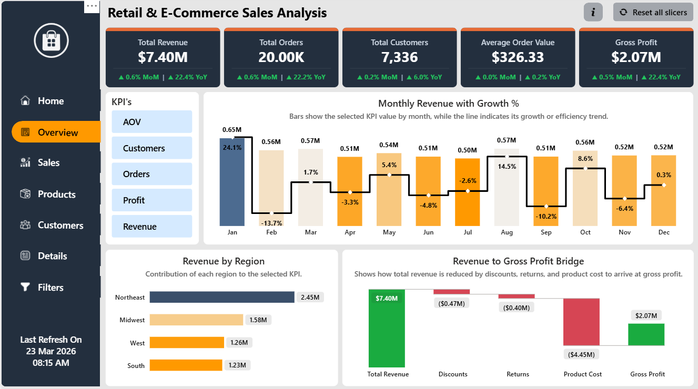
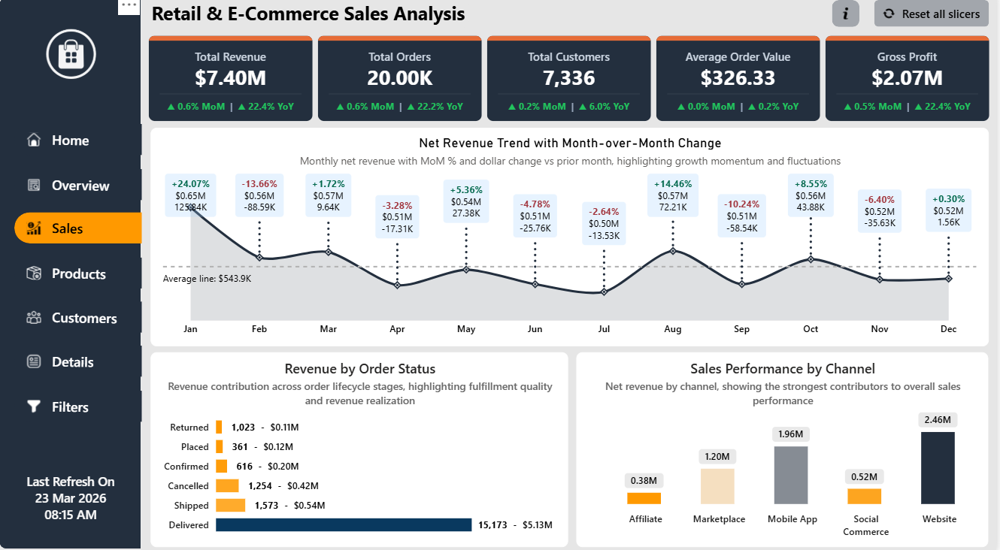

# Retail & E-Commerce Sales Analysis

End-to-end analytics solution on **Microsoft Fabric** and **Power BI**: raw Excel → medallion lakehouse (Bronze / Silver / Gold) → star-schema semantic model → interactive report, orchestrated by a Fabric pipeline.

## Live Report
https://app.powerbi.com/view?r=eyJrIjoiZGNkYzI4NGItY2FiNS00Njg0LTg5NGUtY2UyOTZiNGFkNTNkIiwidCI6IjI1Y2UwMjYxLWJiZDYtNDljZC1hMWUyLTU0MjYwODg2ZDE1OSJ9&pageName=fa9b1cf475e064bbb51d




## Challenge Context

Built for the **Power BI School Dashboard Competition (Dashboard Wars: Season 1)**: https://www.skool.com/powerbi-school-6896/can-your-dashboard-win-50

The challenge focused on a business-oriented dashboard that turns raw data into actionable insight through analytical clarity, usability and storytelling.

## Table of Contents
1. [Overview and objective](#overview-and-objective)
2. [Architecture](#architecture)
3. [Prerequisites](#prerequisites)
4. [Fabric items and naming convention](#fabric-items-and-naming-convention)
5. [Fabric workflow, step by step](#fabric-workflow-step-by-step)
6. [Orchestration](#orchestration)
7. [Data model](#data-model)
8. [Semantic model](#semantic-model)
9. [DAX measures](#dax-measures)
10. [Storage mode: Import, and why not Direct Lake](#storage-mode-import-and-why-not-direct-lake)
11. [Refresh strategy](#refresh-strategy)
12. [Semantic model cloud connection](#semantic-model-cloud-connection)
13. [Row-level security](#row-level-security)
14. [Report pages and features](#report-pages-and-features)
15. [Performance, validation and SQL cross-check](#performance-validation-and-sql-cross-check)
16. [Source control](#source-control)
17. [Repository structure](#repository-structure)
18. [Technology stack](#technology-stack)

---

## Overview and objective

The solution provides visibility into:

- revenue trends and performance drivers
- customer acquisition, retention and repeat behavior
- product and category contribution
- profitability and margin performance
- channel and regional distribution
- order quality: delivery, cancellation and returns

**Scale:** about 30,848 order-item rows, 20,000 orders, 8,000 customers, 200 products, 150 geographies and 4 regions.

---

## Architecture

```text
OLTP.xlsx → Bronze (dbo.*_raw) → Silver → Gold → Semantic Model (Import) → Power BI Report
```


| Layer | What happens |
|---|---|
| **Bronze** (`dbo.*_raw`) | `01_NB_Bronze_Ingestion` loads every sheet of `OLTP.xlsx` (11 sheets) into Delta tables. It replaced the original Dataflow Gen2 step: no gateway or OAuth connection needed, and it is re-runnable. |
| **Silver** | Trims text (blank → NULL), enforces data types, pads postal codes, drops NULL and duplicate business keys, adds `_load_ts`. |
| **Gold** | Builds the dimensional model with a data-quality gate: if any check fails the notebook errors and the pipeline does not refresh the model. |
| **Semantic model** | Import-mode star schema with centralised DAX. |
| **Report** | KPI-first dashboard with guided navigation. |

---

## Prerequisites

- Microsoft Fabric workspace access (Fabric / trial / Premium capacity)
- Lakehouse and Notebook support
- Power BI Desktop (with the *Power BI Project (.pbip)* preview feature enabled for source control)
- Power BI Service access to the semantic model and report
- Permission to create or refresh Fabric items

---

## Fabric items and naming convention

Items follow `<NN>_<TYPE>_<Layer>_<Purpose>`. The number is the run order, so items sort top-to-bottom in the workspace list. The workspace is `Retail-Ecommerce-Analytics_DEV` (dev only).

| Item | Type | Role |
|---|---|---|
| `00_PL_Master_Orchestration` | Pipeline | Runs the steps below in order |
| `01_NB_Bronze_Ingestion` | Notebook | `OLTP.xlsx` → `dbo.*_raw` |
| `02_DF_Bronze_Ingest_OltpExcel` | Dataflow Gen2 | Original Bronze approach, now replaced by the notebook |
| `03_NB_Silver_Standardize` | Notebook | Bronze → Silver |
| `04_NB_Gold_Dimensional_Model` | Notebook | Silver → Gold star schema and data-quality gate |
| `06_SM_Ecommerce_Sales` | Semantic model | Import model used by the report |
| `06_SM_Ecommerce_Sales_DL` | Semantic model | Direct Lake validation model (see below) |
| `07_RPT_Ecommerce_Sales_Overview` | Report | Final dashboard |
| `LH_Ecommerce` | Lakehouse | Storage for `dbo`, `silver` and `gold` (lakehouse names cannot start with a digit) |

Prefixes: PL pipeline, DF dataflow, NB notebook, SM semantic model, RPT report, LH lakehouse. No environment suffixes on items.

---

## Fabric workflow, step by step

1. **Source data.** One Excel file, `OLTP.xlsx`, with customers, products, orders, order items, customer segments and addresses, channels, geography, regions, order statuses and dates. It is reviewed first so entities, fields and reporting scope are clear.
2. **Bronze ingestion.** `01_NB_Bronze_Ingestion` reads the workbook with pandas, turns blanks into real NULLs, and writes `dbo.<sheet>_raw` Delta tables. It fails the run if any sheet loads empty.
3. **Silver standardization.** `03_NB_Silver_Standardize` cleans and types each table and writes `silver.*`, then reports raw vs silver row counts and dropped rows. The pipeline stops if any Silver table is empty.
4. **Gold dimensional modeling.** `04_NB_Gold_Dimensional_Model` creates `dim_region`, `dim_geography`, `dim_customer`, `dim_product` and `fact_sales_order_item`, with analytical keys and reporting-ready fields.
5. **Lakehouse foundation.** `LH_Ecommerce` holds all three layers and is the single backend store.
6. **Semantic model.** Built on the Gold tables in Import mode with relationships, measures, RLS and refresh design.
7. **Report.** Built on the semantic model, never on raw tables.
8. **Orchestration.** The pipeline chains the steps and refreshes the model.

Connecting the report to the semantic model (not directly to the lakehouse) gives cleaner business logic, controlled relationships, reusable measures, better security control and better performance.

**Execution order for a manual run:** Bronze notebook → check `dbo` tables → Silver notebook → check Silver → Gold notebook → check Gold fact and dimensions → refresh the semantic model → open the report.

---

## Orchestration

Pipeline `00_PL_Master_Orchestration`:

```text
01_NB_Bronze_Ingestion
   → 03_NB_Silver_Standardize         (on success)
   → 04_NB_Gold_Dimensional_Model     (on success)
   → Semantic model refresh           (on success)
```

- dependency-based sequential execution
- backend automation across ingestion, Silver and Gold
- semantic model refresh as the last step, only after Gold passes its quality checks
- monitoring through Fabric pipeline run history

---

## Data model

A **star schema** at order-item granularity.

- **Fact:** `fact_sales_order_item`
- **Dimensions:** `dim_date`, `dim_customer`, `dim_product`, `dim_geography`, `dim_region`

Principles: clear fact/dimension separation, single-direction relationships, no many-to-many, business-friendly slicing.

---

## Semantic model

The model centres on `fact_sales_order_item`, with these supporting tables:

| Table | Purpose |
|---|---|
| `_Measures` | Centralised DAX |
| `KPI Selector`, `KPI Combo Selector` | Dynamic metric switching |
| `_Detail Rows` | Controlled detail-row presentation |
| `_Revenue Bridge` | Revenue-to-profit bridge analysis |
| `Last Refresh` | Refresh visibility in the report |
| `UserRegionAccess` | Row-level security mapping |

This supports reusable business logic, controlled filter flow, analytical flexibility and secure consumption.

---

## DAX measures

Business logic lives in measures, with calculated columns kept to a minimum.

| Area | Measures |
|---|---|
| Core KPIs | Net Revenue, Gross Sales, Order Count, Customer Count, Average Order Value, Gross Profit, Gross Margin % |
| Profitability | Discount Amount, Return Amount, Product Cost, Revenue vs Profit |
| Customer | Total, New and Repeat Customers, Repeat Customer Rate, customer contribution to revenue |
| Order quality | Delivery Rate, Cancellation Rate, Return Rate, order status breakdown, customer order sequence |
| Time intelligence | MoM, YoY, YTD, rolling periods, prior-period variance |
| Contribution | Product and category revenue and contribution %, regional and channel share |
| Dynamic analysis | KPI selector, context-aware KPI analysis, measures reused across pages |

---

## Storage mode: Import, and why not Direct Lake

The production semantic model (`06_SM_Ecommerce_Sales`) is **Import** mode over the Gold tables. I also built `06_SM_Ecommerce_Sales_DL`, a **Direct Lake on OneLake** version of the same model, to evaluate whether to switch. These are the challenges that surfaced:

| # | Challenge | What happened here | Import | DirectQuery | Direct Lake |
|---|---|---|---|---|---|
| 1 | Calculated columns and tables on lake tables | `Price Band`, `Running Balance`, `Impact vs Revenue %` and the DAX-built `dim_date` were rejected | Allowed | Limited | Not allowed when they reference lake tables, so they must move into Gold |
| 2 | Strict data-type matching | `fact.GeographyKey` is `long` but `dim_geography.GeographyKey` is `string`; Import coerced it | Coerces | Mostly coerces | Relationship rejected |
| 3 | Schema drift | Gold `dim_customer` now has `HomeStateName` and `CustomerSegmentName` where the model expected `HomeState` and `CustomerSegment` | Surfaces on next refresh | Surfaces on query | Framing fails immediately |
| 4 | Credentials | Refresh failed: *"uses a default data connection without explicit connection credentials"* | Data source credentials | Data source credentials | Needs SSO or an explicit cloud connection |
| 5 | Framing | A new model has no queryable tables until framed | Refresh loads data | None | Frame after each Gold load |
| 6 | Incremental refresh | The `RangeStart` / `RangeEnd` policy has no meaning | Supported | Not applicable | Not applicable |
| 7 | Power Query shaping | Type change and row filter on `OrderDate` lived in M | Anywhere in M | Folding only | Must move into the notebooks |
| 8 | Helper M tables and auto date/time | `Last Refresh` and auto date tables are not supported | Allowed | Allowed | Not supported |
| 9 | SQL endpoint vs OneLake flavour | The SQL-endpoint flavour can fall back to DirectQuery (for example with RLS) | n/a | n/a | Choose deliberately |

**To move to Direct Lake:** align the `GeographyKey` types, compute `Price Band` and `dim_date` in Gold, rebuild `_Revenue Bridge` as measures only, align column names with Gold, set an explicit connection, and frame the model at the end of the pipeline.

For roughly 4.5 MB of source data, Import is the simpler and fully supported choice, so it stays the working model.

---

## Refresh strategy

- **Backend refresh:** the pipeline runs Bronze, Silver and Gold in sequence.
- **Semantic model refresh:** runs only after Gold completes, so reports match the latest processed data.
- **Scheduled refresh:** the pipeline runs on a schedule so the Import model stays current.
- **Incremental refresh:** `fact_sales_order_item` uses a basic policy: a rolling 5-year window, refreshing the most recent month, partitioned by order date through `RangeStart` / `RangeEnd`.

Check these after a refresh: model refresh status, latest data in the report, the *Last Refresh On* value, and run history in Fabric / Power BI Service.

---

## Semantic model cloud connection

**Issue.** Semantic model refresh was mapped to the default Single Sign-On connection instead of a dedicated cloud connection. That can make refresh unstable and the authentication path harder to control.

**Resolution.** A dedicated, named cloud connection was created and the semantic model was mapped to it explicitly.

- explicit connection mapping at the model level
- managed authentication through the selected connection
- a stable, reusable refresh path

**Impact.** Refresh configuration became easier to manage, aligned with the expected authentication flow, and the backend-to-report workflow became more reliable. This matters most when the model is refreshed as part of a Fabric pipeline. The same fix is needed for the Direct Lake validation model.

---

## Row-level security

RLS restricts data to the subset relevant to each user's business scope, using the `UserRegionAccess` mapping table.

- typical scopes: region, business unit, channel, user-to-region or user-to-segment mapping
- dynamic RLS with `USERPRINCIPALNAME()` and the access-mapping table
- design rules: simple and maintainable, no duplicated reports, predictable filter propagation, roles aligned with real access needs
- test each role in Power BI Desktop, confirm user-specific results in the Service, and check totals, filters and drill behavior under restriction

---

## Report pages and features



| Page | Purpose |
|---|---|
| **Home** | Entry point, navigation and report introduction |
| **Overview** | Executive KPIs, revenue and high-level performance |
| **Sales** | Revenue trends, MoM comparison, channel breakdown, order status, daily and monthly trends |
| **Products** | Category and product contribution, top and bottom performers |
| **Customers** | Customer growth, segmentation and repeat behavior |
| **Details** | Deeper financial and operational breakdowns, variance review |
| **Info / Guide pages** | How to use the report, KPI guidance, filter and reset behavior, what *Last Refresh On* means |

Screenshots of every page are in [assets/screenshots](assets/screenshots).

**Usability features**
- **Bookmarks:** a filter pane that shows and hides on demand, guided navigation, reset-style interactions and a clean default view.
- **Tooltips:** KPI tooltips explain what a metric means and how to read it. Contextual tooltips add detail where space is limited.
- **Reset and navigation:** reset all slicers, a page navigation menu and return-to-default-view.
- **Last Refresh On:** a visible timestamp so users can confirm data freshness.
- **Design principles:** KPI-first layout, clear visual hierarchy, business storytelling, consistent formatting and navigation.

---

## Performance, validation and SQL cross-check

**Performance:** star schema, selective columns, measure-first design, few calculated columns, clean relationship paths, appropriate fact granularity, efficient DAX and layouts tuned for rendering.

**Validation:**
- compare KPI outputs against the transformed source data
- check consistency across the Bronze, Silver and Gold layers
- validate joins and relationships
- test filter interactions and DAX in different contexts
- confirm visuals match business logic

Validation baseline from the Import model: 30,848 fact rows · 20,000 orders · total revenue 7,395,903.80 · gross profit 2,073,885.02.

### SQL cross-check

[`sql/validation_queries.sql`](sql/validation_queries.sql) re-checks the report numbers with plain T-SQL on the Gold tables. Connect SSMS to the SQL analytics endpoint of `LH_Ecommerce` (Microsoft Entra ID login) and run it section by section. Each query is commented with the value Power BI shows:

- row counts and headline KPIs (revenue, net revenue, orders, customers, gross profit, units, average order value, margin)
- how net revenue is built: gross sales minus discount minus returns
- order status counts and delivery, return and cancellation rates
- net revenue by year and by month, with month-over-month change
- net revenue by region, channel and category, and the top 5 products
- customers: returning customers, repeat rate and customer segments
- four quick data checks that should all return 0

All values matched the report when checked. Points worth remembering when reading the numbers:

- "Total Revenue" in the report is **gross** sales. "Net Revenue" is after discount and returns.
- The fact table has one row per order item (30,848 rows) but 20,000 orders, so orders and customers are counted with `COUNT(DISTINCT ...)`.
- Returned orders (2,040) is larger than orders with the status "Returned" (1,023), because an order can be delivered first and returned later.
- Orders run from 1 Jan 2021 to 10 Mar 2026, so 2026 is a part year.

---

## Source control

The workspace is connected to **Azure DevOps** through Fabric Git integration (branch `main`, Git folder `/fabric`), and the report also opens as a Power BI Project (`.pbip`) in Desktop.

- Items are stored one folder each (`<name>.<Type>`) in Fabric's Git format, so changes can be reviewed in pull requests.
- The lakehouse is versioned as metadata only, not data.
- Rename items in the portal and let Git pick it up, rather than renaming folders by hand.
- Workspace, lakehouse, server and item identifiers, and the account emails in the RLS table, are replaced with placeholders in this public copy.

---

## Repository structure

```text
Retail-E-Commerce-Sales-Analysis/
├── README.md
├── LICENSE
├── .gitignore
├── assets/
│   ├── architecture/        pipeline and semantic model diagrams
│   ├── screenshots/         one image per report page
│   └── icons/               icons used in the report
├── fabric/
│   ├── notebooks/           Bronze, Silver and Gold notebooks (.ipynb)
│   └── pipeline/            master orchestration pipeline (JSON)
├── sql/
│   └── validation_queries.sql   SSMS cross-check of the report numbers
└── powerbi/
    ├── RetailSalesAnalytics.pbip
    ├── 07_RPT_Ecommerce_Sales_Overview.Report
    └── 06_SM_Ecommerce_Sales.SemanticModel
```

---

## Technology stack

Microsoft Fabric · Fabric Pipelines · Lakehouse (Delta) · PySpark and Spark SQL notebooks · Power BI · DAX · Import-mode semantic model · Bookmarks and tooltips · Row-level security · Incremental refresh · Azure DevOps Git integration

---

## Conclusion

This repository presents a complete retail and e-commerce analytics workflow: ingestion, medallion transformation, dimensional modeling, orchestration, semantic modeling, DAX, security, refresh strategy, guided report interaction and reporting in one structured solution.

## Connect

For questions, feedback or collaboration, connect on LinkedIn: [LinkedIn Profile](https://www.linkedin.com/in/bhushangawali148/)
